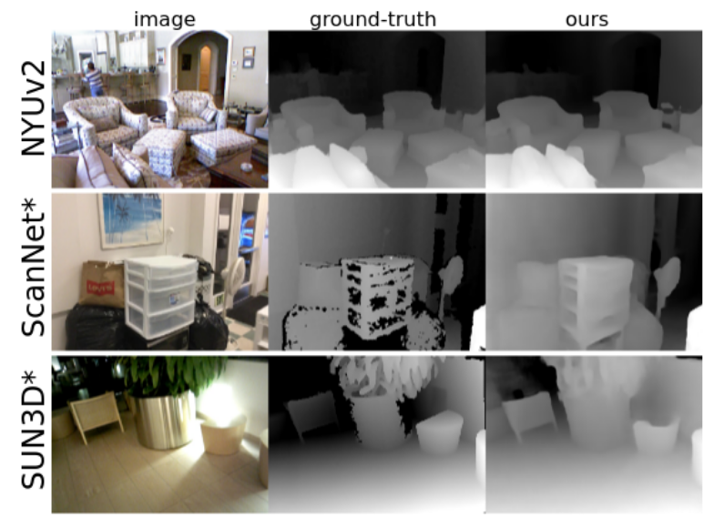

# DeepV2D
This repository contains the source code for our paper:

[DeepV2D: Video to Depth with Differentiable Structure from Motion](https://arxiv.org/abs/1812.04605)<br/>
Zachary Teed and Jia Deng<br/>
International Conference on Learning Representations (ICLR) 2020<br/>

 


## Requirements
Our code was tested using Tensorflow 1.12.0 and Python 3. To use the code, you need to first install the following python packages:

First create a clean virtualenv 

  ```Shell
  virtualenv --no-site-packages -p python3 deepv2d_env
  source deepv2d_env/bin/activate
  ```

  ```Shell
  pip install tensorflow-gpu==1.12.0
  pip install h5py
  pip install easydict
  pip install scipy
  pip install opencv-python
  pip install pyyaml
  pip install toposort
  pip install vtk
  ```

You can optionally compile our cuda backprojection operator by running

```Shell
cd deepv2d/special_ops && ./make.sh && cd ../..
```

This will reduce peak GPU memory usage. You may need to change CUDALIB to where you have cuda is installed.


## Demos

### Video to Depth (V2D)

Try it out on one of the provided test sequences. First download our pretrained models

```Shell
./data/download_models.sh
```
or from [google drive](https://drive.google.com/file/d/1pEUwOw_aOCIz53dGXOnU3KXArzR41YAV/view?usp=sharing)

The demo code will output a depth map and display a point cloud for visualization. Once the depth map has appeared, press any key to open the point cloud visualization.

[NYUv2](https://cs.nyu.edu/~silberman/datasets/nyu_depth_v2.html):
```Shell
python demos/demo_v2d.py --model=models/nyu.ckpt --sequence=data/demos/nyu_0
```

[ScanNet](http://www.scan-net.org/):
```Shell
python demos/demo_v2d.py --model=models/scannet.ckpt --sequence=data/demos/scannet_0
```

[KITTI](http://www.cvlibs.net/datasets/kitti/):
```Shell
python demos/demo_v2d.py --model=models/kitti.ckpt --sequence=data/demos/kitti_0
```

You can also run motion estimation in `global` mode which updates all the poses jointly as a single optimization problem

```Shell
python demos/demo_v2d.py --model=models/nyu.ckpt --sequence=data/demos/nyu_0 --mode=global
```

### Uncalibrated Video to Depth (V2D-Uncalibrated)

If you do not know the camera intrinsics you can run DeepV2D in uncalibrated mode. In the uncalibrated setting, the motion module estimates the focal length during inference. 

```Shell
python demos/demo_uncalibrated.py --video=data/demos/golf.mov
```


### SLAM / VO

DeepV2D can also be used for tracking and mapping on longer videos. First, download some test sequences

```Shell
./data/download_slam_sequences.sh
```

Try it out on [NYU-Depth](https://cs.nyu.edu/~silberman/datasets/nyu_depth_v2.html), [ScanNet](http://www.scan-net.org/), [TUM-RGBD](https://vision.in.tum.de/data/datasets/rgbd-dataset), or [KITTI](http://www.cvlibs.net/datasets/kitti/). Using more keyframes `--n_keyframes=?` reduces drift but results in slower tracking.


```Shell
python demos/demo_slam.py --dataset=kitti --n_keyframes=2
```

```Shell
python demos/demo_slam.py --dataset=scannet --n_keyframes=3
```

The `--cinematic` flag forces the visualization to follow the camera
```Shell
python demos/demo_slam.py --dataset=nyu --n_keyframes=3 --cinematic
```

The `--clear_points` flag can be used so that only the point cloud of the current depth is plotted.
```Shell
python demos/demo_slam.py --dataset=tum --n_keyframes=3 --clear_points
```


## Evaluation

You can evaluate the trained models on one of the datasets...

#### [NYUv2](https://cs.nyu.edu/~silberman/datasets/nyu_depth_v2.html):
```Shell
./data/download_nyu_data.sh
python evaluation/eval_nyu.py --model=models/nyu.ckpt
```

#### [KITTI](http://www.cvlibs.net/datasets/kitti/):
First download the dataset using this [script](http://www.cvlibs.net/download.php?file=raw_data_downloader.zip) provided on the official website. Then run the evaluation script where KITTI_PATH is the location of where the dataset was downloaded

```Shell
./data/download_kitti_data.sh
python evaluation/eval_kitti.py --model=models/kitti.ckpt --dataset_dir=KITTI_PATH
```

#### [ScanNet](http://www.scan-net.org/):
First download the [ScanNet](https://github.com/ScanNet/ScanNet) dataset.

Then run the evaluation script where SCANNET_PATH is the location of where you downloaded ScanNet

```Shell
python evaluation/eval_scannet.py --model=models/scannet.ckpt --dataset_dir=SCANNET_PATH
```


## Training

You can train a model on one of the datasets

#### [NYUv2](https://cs.nyu.edu/~silberman/datasets/nyu_depth_v2.html):
First download the training tfrecords file [here](https://drive.google.com/file/d/1-kfW55tpwxFVfv9AL76IFXWuNMBE3b7Y/view?usp=sharing
) (143Gb) containing the NYU data. Once the data has been downloaded, train the model by running the command (training takes about 1 week on a Nvidia 1080Ti GPU)

Camera poses for NYU were estimated using [ORB-SLAM2](https://github.com/raulmur/ORB_SLAM2) using kinect measurements. You can download the estimated poses from [google drive](https://drive.google.com/file/d/13L8ZrFQM1Jlghicvi6dACosK2hu2T45g/view?usp=sharing).

```Shell
python training/train_nyu.py --cfg=cfgs/nyu.yaml --name=nyu_model --tfrecords=nyu_train.tfrecords
```

Note: this creates a temporary directory which is used to store intermediate depth predictions. You can specify the location of the temporary directory using the `--tmp` flag. You can use multiple gpus by using the `--num_gpus` flag. If you train with multiple gpus, you can reduce the number of training iterations in cfgs/nyu.yaml.


#### [KITTI](http://www.cvlibs.net/datasets/kitti/):
First download the dataset using this [script](http://www.cvlibs.net/download.php?file=raw_data_downloader.zip) provided on the official website. Once the dataset has been downloaded, write the training sequences to a tfrecords file

```Shell
python training/write_tfrecords.py --dataset=kitti --dataset_dir=KITTI_DIR --records_file=kitti_train.tfrecords
```

You can now train the model (training takes about 1 week on a Nvidia 1080Ti GPU). Note: this creates a temporary directory which is used to store intermediate depth predictions. You can specify the location of the temporary directory using the `--tmp` flag. You can use multiple gpus by using the `--num_gpus` flag.

```Shell
python training/train_kitti.py --cfg=cfgs/kitti.yaml --name=kitti_model --tfrecords=kitti_train.tfrecords
```

#### [ScanNet](http://www.scan-net.org/):
```Shell
python training/train_scannet.py --cfg=cfgs/scannet.yaml --name=scannet_model --dataset_dir="path to scannet"
```