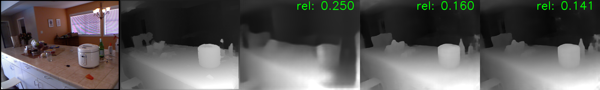

# DeepV2D
Tensorflow implementation of DeepV2D: Video to Depth with Differentiable Structure from Motion.

[DeepV2D: Video to Depth with Differentiable Structure from Motion](https://arxiv.org/abs/1812.04605)

Zachary Teed, Jia Deng



## Requirements
This code was tested with Tensorflow 1.10.1, CUDA 9.0 and Ubuntu 16.04. The demo and evaluation code has been tested with python2.7 and python3. The training code has only been tested with python2.7. Training requires at least 11Gb of GPU memory. You will need to install the following python libraries to run the code

  ```Shell
  pip install tensorflow-gpu==1.10.1
  pip install h5py
  pip install easydict
  pip install scipy
  pip install opencv-python
  pip install pyyaml
  pip install toposort
  ```

## Demos
We've provided several demo sequences from KITTI and NYU. First download the weights of the trained models
  ```Shell
  ./download_models.sh
  ```

Once the weights have been downloaded, you can run the model on one of the example videos in the demo_videos folder
  ```Shell
  python demos/kitti_demo.py --cfg cfgs/kitti.yaml --sequence demo_videos/kitti_demos/032/
  python demos/nyu_demo.py --cfg cfgs/nyu.yaml --sequence demo_videos/nyu_demos/116/
  ```

### Tracking Demo
As default, DeepV2D operates inplace. It takes a video clip as input and iteratively estimates the depth of the keyframe and the relative pose between the keyframe and each of the other frames in the video.  However, DeepV2D can be converted into a simple (admittedly slow) keyframe-based SLAM system. We provide a demo of these capabilities:

First download some sample videos and poses from the NYU test set:

  ```Shell
  wget https://www.dropbox.com/s/zh3n98tvjwomzxy/slam_demos.zip?dl=0
  unzip slam_demos.zip?dl=0
  ```

Then you can run the SLAM demo on one of the sequences. The demo will display the keyframe depth estimates and also the trajectory of the camera. The estimated trajectory is compared with psuedo-gt poses obtained using RGB-D ORB-SLAM (ORB-SLAM is given RGB-D frames as input, our approach is just given RGB frames):

  ```Shell
  python demos/nyu_slam.py --sequence slam_demos/living_room/
  ```


## Training and Evaluation

To run the training code, you will first need to compile the backprojection operator.

  ```Shell
  cd lib/special_ops/
  TF_CFLAGS=( $(python -c 'import tensorflow as tf; print(" ".join(tf.sysconfig.get_compile_flags()))') )
  TF_LFLAGS=( $(python -c 'import tensorflow as tf; print(" ".join(tf.sysconfig.get_link_flags()))') )

  nvcc -std=c++11 -c -o backproject_op_gpu.cu.o backproject_op_gpu.cu.cc \
    ${TF_CFLAGS[@]} -D GOOGLE_CUDA=1 -x cu -Xcompiler -fPIC

  g++ -std=c++11 -shared -o backproject.so backproject_op.cc \
    backproject_op_gpu.cu.o ${TF_CFLAGS[@]} -D GOOGLE_CUDA=1 -fPIC ${TF_LFLAGS[@]}

  cd ../..
  ```

### [NYU](https://cs.nyu.edu/~silberman/datasets/nyu_depth_v2.html)

We provide training data from NYU as a tfrecords file (143 Gb) which can be downloaded from this link:
  ```Shell
  https://drive.google.com/file/d/1-kfW55tpwxFVfv9AL76IFXWuNMBE3b7Y/view?usp=sharing
  ```
To train the model, run the following command (training takes about 1 week on a Nvidia 1080Ti GPU, requires 11Gb of memory). Note: this creates a temporary directory which is used to store intermediate depth predictions. You can specify the location of the temporary directory using the --tmp flag.

  ```Shell
  python train_nyu.py --cfg cfgs/nyu.yaml --name nyu_deepv2d --tfrecords nyu_train.tfrecords
  ```

To evaluate the trained model, first download the official NYU testing data and splits file, also download our testing videos which were created by sampling frames around the keyframe.

  ```Shell
  mkdir nyu_data && cd nyu_data
  wget http://horatio.cs.nyu.edu/mit/silberman/nyu_depth_v2/nyu_depth_v2_labeled.mat
  wget http://horatio.cs.nyu.edu/mit/silberman/indoor_seg_sup/splits.mat
  wget https://www.dropbox.com/s/wrot2mjlnm4v3j6/nyu_test.zip?dl=0
  unzip nyu_test.zip?dl=0
  cd ..
  ```

To evaluate, first run the model on the test videos. Then run the evaluation script. The --viz flag can be used to visualize the depth maps during inference. --fcrn_init tells the network to use single image initialization.

  ```Shell
  python demos/nyu_evaluate.py --cfg cfgs/nyu.yaml --model models/nyu/_stage_2.ckpt-120000 --viz --fcrn_init
  python tools/nyu_evaluate_depth.py --gt_file nyu_data/nyu_depth_v2_labeled.mat --split_file nyu_data/splits.mat --pred_file nyu_pred.npy
  ```

### [KITTI](http://www.cvlibs.net/datasets/kitti/)

First download the dataset using this [script](http://www.cvlibs.net/download.php?file=raw_data_downloader.zip) provided on the official website. Once the sequences have been downloaded and extracted. Write the training sequences to a tfrecords file


  ```Shell
  python tools/write_tfrecords.py --dataset kitti --dataset_dir KITTI_DIR --records_file kitti_train.tfrecords
  ```

You can now train the model (training takes about 1 week on a Nvidia 1080Ti GPU, requires 11Gb of memory). Note: this creates a temporary directory which is used to store intermediate depth predictions. You can specify the location of the temporary directory using the --tmp flag.

  ```Shell
  python train_kitti.py --cfg cfgs/kitti.yaml --name kitti_model --tfrecords kitti_train.tfrecords
  ```

To evaluate, first run the model on the test videos. Our evaluated code is based on the evaluation code from [SfMLearner](https://github.com/tinghuiz/SfMLearner).


  ```Shell
  python demos/kitti_evaluate.py --dataset_dir KITTI_DIR --cfg cfgs/kitti.yaml --model models/kitti/_stage_2.ckpt-120000 --viz
  python tools/kitti_evaluate_depth.py --kitti_dir KITTI_DIR --pred_file kitti_pred.npy
  ```
